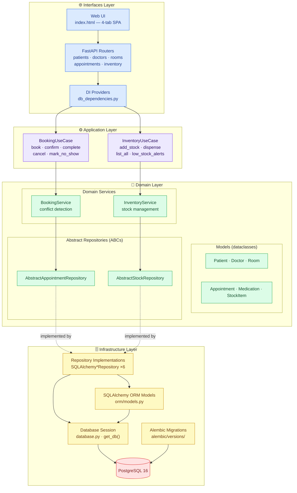

# MediStock — Project Overview

## Goal

MediStock is a hospital management back-end that handles patient registration,
doctor scheduling, room assignment, appointment booking, and medication
inventory tracking.  It exposes a REST API (FastAPI) and a minimal web UI, and
is designed to run in a Docker container backed by PostgreSQL.

---

## Architecture

MediStock follows **Clean Architecture** (also called Hexagonal or Onion
Architecture).  Business logic lives in the innermost layers and knows nothing
about databases or HTTP; the outer layers adapt the core to concrete
technologies.

### Dependency rule

Arrows point **inward only**.  The domain layer imports nothing from
infrastructure or interfaces.  Infrastructure imports domain interfaces
(abstract repos, domain models).  The interfaces layer imports application
use cases and, when needed, domain models for response serialization.

---

## Layer Descriptions

### Domain Layer (`medistock/domain/`)

Contains the core business concepts with no external dependencies.

| Module | Purpose |
|--------|---------|
| `models/patient.py` | Patient entity — validation, `full_name`, `deactivate()` |
| `models/doctor.py` | Doctor entity — "Dr." prefix, specialization |
| `models/room.py` | Room entity — availability toggle |
| `models/appointment.py` | Appointment aggregate — status state machine, overlap detection |
| `models/medication.py` | Medication entity |
| `models/stock_item.py` | StockItem entity — `add_stock()`, `dispense()`, low-stock flag |
| `services.py` | `BookingService` (conflict-checked booking), `InventoryService` (stock ops); abstract repository interfaces |

All domain objects are Python `@dataclass` instances.  Validation runs in
`__post_init__`.  Repositories bypass `__post_init__` via `object.__new__()` to
avoid re-validating historical records loaded from the database.

### Application Layer (`medistock/application/`)

Thin orchestration layer between the HTTP interfaces and domain services.

| Class | Responsibility |
|-------|----------------|
| `BookingUseCase` | Resolves patient / doctor / room IDs → objects, then delegates to `BookingService` |
| `InventoryUseCase` | Resolves medication IDs → objects, then delegates to `InventoryService` |

Raises `LookupError` for missing entities (→ HTTP 404) and lets domain
`ValueError` propagate naturally (→ HTTP 422).

### Infrastructure Layer (`medistock/infrastructure/`)

Adapts the domain to PostgreSQL via SQLAlchemy.

| Module | Purpose |
|--------|---------|
| `orm/models.py` | ORM mappings for all six domain entities |
| `repositories/` | Concrete `SQLAlchemy*Repository` classes implementing the abstract repos |
| `repositories/base.py` | `safe_commit()` context manager, domain↔ORM conversion helpers, `DuplicateEntryError` |
| `database.py` | Engine, session factory, `get_db()` FastAPI dependency |

### Interfaces Layer (`medistock/interfaces/`)

Adapts the application layer to HTTP and HTML.

| Module | Purpose |
|--------|---------|
| `api/main.py` | FastAPI app, middleware, router registration, static file mount |
| `api/routers/` | One file per resource group: patients, doctors_rooms, appointments, inventory |
| `api/db_dependencies.py` | FastAPI `Depends()` factories — wire repos, services, and use cases |
| `web/static/index.html` | Single-page vanilla JS UI with four tabs |

---

## Design Decisions

### Why Clean Architecture?

The capstone project needed to demonstrate separation of concerns.  Clean
Architecture makes each layer independently testable: unit tests mock
repositories, integration tests swap the database via `get_db` override, and
the domain runs in isolation without any framework.

### Why dataclasses instead of Pydantic models in the domain?

Pydantic is used at the API boundary (request/response schemas).  Domain
entities are plain Python dataclasses so they carry zero FastAPI or SQLAlchemy
coupling; they can be tested or reused in a CLI or background worker without
importing the web framework.

### Why `object.__new__()` in repository hydration?

`__post_init__` validates constraints like "appointment must be in the future."
Historical records loaded from the database would always fail that check.
Bypassing `__post_init__` lets the ORM layer reconstruct domain objects from
stored data without silently mutating or discarding them.

### Why `safe_commit()` instead of try/except in every save()?

Every `save()` method commits.  Wrapping the commit in a context manager
that catches `IntegrityError` → `DuplicateEntryError` keeps the error-handling
in one place and keeps repository code free of database-specific exceptions.

### Why an Application layer on top of the Domain services?

The booking workflow requires resolving three separate IDs (patient, doctor,
room) before calling `BookingService.book_appointment()`.  Without a use case
layer, each router endpoint would own that lookup logic, duplicating it if a
second interface (CLI, gRPC) were added later.  The use case is also the right
place for future cross-cutting concerns such as authorization checks or audit
logging.
