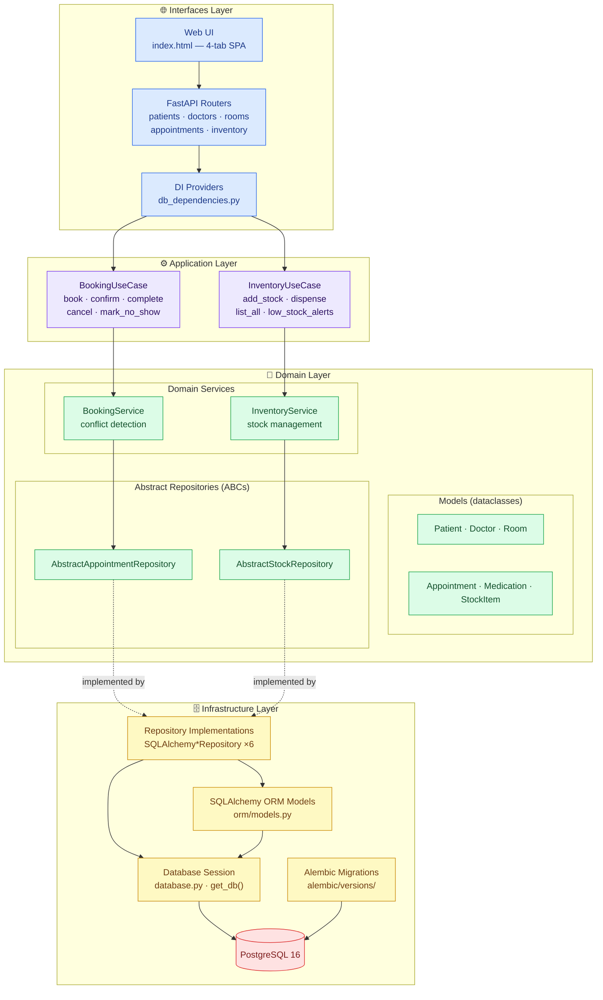

# MediStock — Projektübersicht

## Ziel

MediStock ist ein Backend-System zur Krankenhausverwaltung, das Patientenregistrierung,
Arztplanung, Raumzuweisung, Terminbuchung und Medikamentenbestandsverwaltung übernimmt.
Es stellt eine REST API (FastAPI) sowie eine einfache Web-Oberfläche bereit und ist
für den Betrieb in einem Docker-Container mit PostgreSQL ausgelegt.

---

## Architektur

MediStock folgt der **Clean Architecture** (auch Hexagonale oder Zwiebelarchitektur genannt).
Die Geschäftslogik befindet sich in den innersten Schichten und hat keinerlei Kenntnis
von Datenbanken oder HTTP; die äußeren Schichten passen den Kern an konkrete Technologien an.

### Abhängigkeitsregel

Pfeile zeigen **ausschließlich nach innen**. Die Domänenschicht importiert nichts aus
der Infrastruktur oder den Interfaces. Die Infrastruktur importiert Domänen-Interfaces
(abstrakte Repositories, Domänenmodelle). Die Interfaces-Schicht importiert Anwendungs-Use-Cases
und bei Bedarf Domänenmodelle für die Antwortserialisierung.

---

## Schichtbeschreibungen

### Domänenschicht (`medistock/domain/`)

Enthält die zentralen Geschäftskonzepte ohne externe Abhängigkeiten.

| Modul | Zweck |
|-------|-------|
| `models/patient.py` | Patient-Entity — Validierung, `full_name`, `deactivate()` |
| `models/doctor.py` | Arzt-Entity — „Dr."-Präfix, Fachgebiet |
| `models/room.py` | Raum-Entity — Verfügbarkeitsumschalter |
| `models/appointment.py` | Termin-Aggregat — Status-Zustandsmaschine, Überschneidungserkennung |
| `models/medication.py` | Medikamenten-Entity |
| `models/stock_item.py` | Lagerartikel-Entity — `add_stock()`, `dispense()`, Niedrigbestand-Flag |
| `services.py` | `BookingService` (Buchung mit Konflikterkennung), `InventoryService` (Lageroperationen); abstrakte Repository-Interfaces |

Alle Domänenobjekte sind Python-`@dataclass`-Instanzen. Die Validierung läuft in
`__post_init__`. Repositories umgehen `__post_init__` über `object.__new__()`, um
historische Datenbankeinträge nicht erneut zu validieren.

### Anwendungsschicht (`medistock/application/`)

Dünne Orchestrierungsschicht zwischen den HTTP-Interfaces und den Domänen-Services.

| Klasse | Verantwortung |
|--------|---------------|
| `BookingUseCase` | Löst Patienten-/Arzt-/Raum-IDs zu Objekten auf, delegiert dann an `BookingService` |
| `InventoryUseCase` | Löst Medikamenten-IDs zu Objekten auf, delegiert dann an `InventoryService` |

Wirft `LookupError` bei fehlenden Entitäten (→ HTTP 404) und lässt domänenspezifische
`ValueError` natürlich propagieren (→ HTTP 422).

### Infrastrukturschicht (`medistock/infrastructure/`)

Passt die Domäne über SQLAlchemy an PostgreSQL an.

| Modul | Zweck |
|-------|-------|
| `orm/models.py` | ORM-Mappings für alle sechs Domänen-Entitäten |
| `repositories/` | Konkrete `SQLAlchemy*Repository`-Klassen, die die abstrakten Repos implementieren |
| `repositories/base.py` | `safe_commit()`-Context-Manager, Domäne↔ORM-Konvertierungshelfer, `DuplicateEntryError` |
| `database.py` | Engine, Session-Factory, `get_db()` FastAPI-Dependency |

### Interfaces-Schicht (`medistock/interfaces/`)

Passt die Anwendungsschicht an HTTP und HTML an.

| Modul | Zweck |
|-------|-------|
| `api/main.py` | FastAPI-App, Middleware, Router-Registrierung, Static-File-Mount |
| `api/routers/` | Eine Datei pro Ressourcengruppe: patients, doctors_rooms, appointments, inventory |
| `api/db_dependencies.py` | FastAPI-`Depends()`-Factories — verbinden Repos, Services und Use-Cases |
| `web/static/index.html` | Single-Page Vanilla-JS-UI mit vier Tabs |

---

## Designentscheidungen

### Warum Clean Architecture?

Das Capstone-Projekt sollte Trennung der Verantwortlichkeiten demonstrieren. Clean Architecture
macht jede Schicht unabhängig testbar: Unit-Tests mocken Repositories, Integrationstests
tauschen die Datenbank über das `get_db`-Override aus, und die Domäne läuft isoliert ohne
jegliches Framework.

### Warum Dataclasses statt Pydantic-Modellen in der Domäne?

Pydantic wird an der API-Grenze (Request-/Response-Schemas) eingesetzt. Domänen-Entitäten
sind reine Python-Dataclasses, damit sie keine FastAPI- oder SQLAlchemy-Kopplung tragen;
sie können ohne Import des Web-Frameworks in einem CLI oder Background-Worker getestet
oder wiederverwendet werden.

### Warum `object.__new__()` bei der Repository-Hydration?

`__post_init__` prüft Constraints wie „Termin muss in der Zukunft liegen".
Historische Datenbankeinträge würden diese Prüfung immer fehlschlagen lassen.
Die Umgehung von `__post_init__` erlaubt der ORM-Schicht, Domänenobjekte aus
gespeicherten Daten zu rekonstruieren, ohne sie stillschweigend zu verändern oder zu verwerfen.

### Warum `safe_commit()` statt try/except in jedem `save()`?

Jede `save()`-Methode führt einen Commit durch. Den Commit in einem Context-Manager zu
kapseln, der `IntegrityError` → `DuplicateEntryError` umwandelt, hält die Fehlerbehandlung
an einer Stelle und hält den Repository-Code frei von datenbankspezifischen Ausnahmen.

### Warum eine Anwendungsschicht über den Domänen-Services?

Der Buchungsworkflow erfordert die Auflösung von drei separaten IDs (Patient, Arzt, Raum)
vor dem Aufruf von `BookingService.book_appointment()`. Ohne eine Use-Case-Schicht würde jeder
Router-Endpunkt diese Lookup-Logik besitzen und sie duplizieren, falls später eine zweite
Schnittstelle (CLI, gRPC) hinzugefügt wird. Der Use-Case ist auch der richtige Ort für
zukünftige übergreifende Belange wie Autorisierungsprüfungen oder Audit-Logging.
